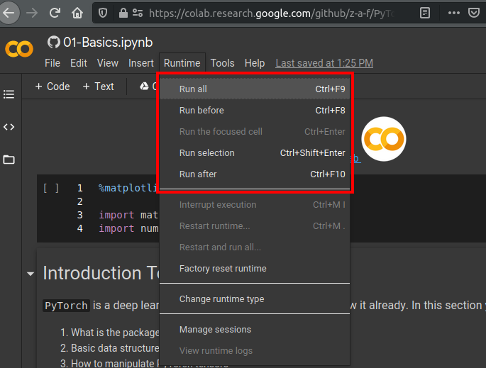

# Deep Learning using PyTorch

This is a set of tutorials that I will be releasing (hopefully) weekly.

## TODOs


## Table of Contents

This is a planned table of contents.
It will be changed as I progress

1. Primer
    1. Mathematics -- this might or might not come
    1. PyTorch
        1. [Basics](00-Primer/PyTorch/Basics.ipynb)
        1. [Torch Packages](00-Primer/PyTorch/PyTorch-Packages.ipynb)
        1. [Training](00-Primer/PyTorch/Training.ipynb)
1. Basic Neural Networks
    1. Binary Classification
    1. Multiclass Classification
    1. Regression
1. Common Routines for Machine Learning
    1. Data Manipulation
    1. Evaluating Models
1. Deep Learning for Computer Vision
    1. Introduction to Convolutional NNs
    1. Transfer Learning
    1. Visualizing ConvNets
1. Deep Learning for Sequences
    1. Encoding Text
    1. Recurrent NN
    1. Sequence Processing with CNN
    1. Transformer and Seq2Seq
1. Deep Generative Networks
    1. Generating Text
    1. Style Transfer Images
    1. Variational Autoencoders
    1. Generative Adversarial Networks
1. Reinforcement Learning
    1. Stock Trading using RL
    1. Game Playing
1. Deploying Models
    1. Serving from a Cloud
    1. PyTorch Mobile Android
    1. PyTorch Mobile iOS
1. Advanced Topics
    1. Quantization
    1. Federated Learning

## Instructions -- Running in Colab

Here are the instructions on how to get the notebook.

**Step 1. Open the notebook in Colab**

Every notebook will have colab icon  on the top.
Clicking it will redirect you to the Google Colab notebooks where you can run the tutorials in the cloud.


After clicking on "Authorize" follow the instruction to log into the GitHub.

**Step 2. Select the runtime type**

Sometimes you will need to use a GPU.
To do that, in the colab notebook select "Runtime" -> "Change runtime type"


Choose the type that you'd like:
- `None` runs the notebook only on CPU
- `GPU` / `TPU` runs the notebook on gpu/tpu

**Step 3. Edit and Run**
You can edit any cell in the notebook by double clicking it.
You can run individual cells or an entire notebook using the "Runtime" menu.
You can also run the currently selected notebook using `Shift+Enter`.



## Instructions -- Running Locally

### Installing prerequisites

Before running the notebooks locally, you need to install some prerequisites:

**Using `pip`**

```shell
# Install jupyter
pip install jupyter
# Install numpy and pandas
pip install numpy pandas
# Install visualization tools
pip install matplotlib seaborn
```

**Using `conda`**

```shell
# Install jupyter
conda install jupyter
# Install numpy and pandas
conda install numpy pandas
# Install visualization tools
conda install matplotlib seaborn
```

**Install GPU support (optional)**

If you have a CUDA GPU, you can set it up to run the PyTorch.
For that you need to install CUDA and cuDNN by following the instructions below.
You can optionally install cuBLAS as well.

- CUDA: https://developer.nvidia.com/cuda-downloads
- cuDNN: https://developer.nvidia.com/cudnn
- cuBLAS: https://developer.nvidia.com/cublas

**Install PyTorch**

Please, follow the instructions here: https://pytorch.org/get-started/locally/

### Running the notebooks

Start the jupyter notebook by running in your terminal (from this directory):

```console
jupyter notebook
```

Which will open a browser window with the list of the directories and notebooks.
You can open an appropriate notebook by clicking on it.
