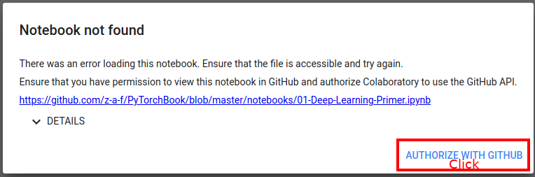

# Deep Learning using PyTorch

This is a set of tutorials that I will be releasing (hopefully) weekly.

## Running in Colab

Here are the instructions on how to get the notebook.

**Step 1. Open the notebook in Colab**

Every notebook will have colab icon  on the top.
Clicking it will redirect you to the Google Colab notebooks where you can run the tutorials in the cloud.

After clicking on "Authorize" follow the instruction to log into the GitHub.

You can edit any cell in the notebook by double clicking it.

## TODOs

1. Write up the documentation on
  1. Installation instructions
  2. How to use Jupyter Notebooks in Colab

